# QtIFW 全流程  

安装包构建 & 仓库构建 & 服务端模拟 & 离线安装后的在线更新

张祝玙 2025/04/23 

> 环境：  Linux Mint 22  
> Cmake： 3.28.3

---

### Qt Installser Framework 工具一览

- `installerbase`：作为维护工具保存在客户端（通常命名为maintenancetool），用于更新、维护和卸载
- `binarycreator`：创建安装程序二进制文件
- `archivegen`：创建组件归档文件
- `repogen`：生成和管理组件仓库
- `devtool`：开发辅助工具，用于测试单个操作
- `repocompare`：仓库比较工具，对比不同版本的仓库内容（这什么玩意？没编出来）

`maintenancetool`实际是配置过的`installerbase`。

创建安装包，流程大致如下（详见 [Tutorial: Creating an Installer](https://doc.qt.io/qtinstallerframework/ifw-tutorial.html)）：  
1. 创建一个包含所有配置文件和可安装包的包目录 。
2. 创建一个配置文件 ，其中包含有关如何构建安装程序二进制文件和在线存储库的信息。
3. 创建包含有关可安装组件信息的包信息文件 。
4. 创建安装程序内容并将其复制到包目录。
5. 使用 `binarycreator` 工具创建安装程序 。

根据官方文档，此处可见`installerbase`的作用：
```bash
<location-of-ifw>\binarycreator.exe -t <location-of-ifw>\installerbase.exe -p <package_directory> -c <config_directory>\<config_file> -e <packages> <installer_name>
```


创建存储库则是使用 `repogen` 工具，详见 [Creating Online Installers](https://doc.qt.io/qtinstallerframework/ifw-online-installers.html)。

---

首先从理论上过一遍：

### 安装包的整体构建流程

- [Creating Installers](https://doc.qt.io/qtinstallerframework/ifw-creating-installers.html)

#### 1. 为可安装组件创建软件包目录：

```txt
-packages
    - com.vendor.root
        - data
        - meta
    - com.vendor.root.component1
        - data
        - meta
    - com.vendor.root.component1.subcomponent1
        - data
        - meta
    - com.vendor.root.component2
        - data
        - meta
```

- `data/` 目录包含安装程序在安装过程中提取的内容，这些数据必须打包到归档文件中。  
  这可以由 `binarycreator` 和 `repogen` 在创建安装程序或存储库时自动完成（指归档）。

- 手动创建档案（压缩包）可以使用附带的 `archivegen` 工具，或手动生成以下格式：`7z` 、 `zip` 、 `tar.gz` 、 `tar.bz2` 和
  `tar.xz` 。

```bash
   archivegen component1.7z component1/
```

#### 2. 在 config 目录中创建一个名为 [`config.xml`](config.xml) 的配置文件。

#### 3. 在 `packages\{component}\meta` 目录中创建一个名为 [`package.xml`](package.xml) 的软件包信息文件。该文件包含部署和安装过程的设置。

#### 4. 创建安装程序内容并将其复制到软件包目录。

#### 5. 对于在线安装程序，使用 `repogen` 工具创建具有可安装内容的存储库并将存储库上传到 Web 服务器。

#### 6. 使用 `binarycreator` 工具创建安装程序。

---

# 实际流程

### 1. 准备组件

此处准备三种资源类型进行模拟：

1) **可执行程序** `component1`：elf 二进制`app1`，echo 命令行参数，并调用动态库（组件`subcomponent1`）；
```c++
int main(int argc, char* argv[]) {
    // ...
    for (int i = 0; i < argc; ++i) {
        std::cout << "  argv[" << i << "] = " << argv[i] << std::endl;
    }
    say_hello();  // 来自 libhelper.so
    // ...
}
```
2) **动态库** `subcomponent1`：`libhelper.so`，提供一个 `say_hello()` 函数；
3) **资源文件**（`.data`）：文本文件，`example.data`与可执行程序打包在一起，`helper.data`和动态库打包在一起；内容通过脚本动态生成。  
例：
```txt
Component1 Resource File
Version: 1.3.0
Timestamp: 2025年 04月 23日 星期三 16:17:38 CST
```

构建源文件初始结构：
```txt
$ tree src                                                              □ QtIFWPackTest △⎪▴│1│▪┤2│●◦◎◦✕⎥via △ v3.28.3  16:18
src
├── component1
│   ├── example.data
│   └── main.cpp
└── subcomponent1
    ├── helper.cpp
    ├── helper.data
    └── helper.h
```

### 2. 编译与版本模拟

通过脚本动态修改上述三种资源的内容，编译为4个版本（`1.0.0`、`1.1.0`、`1.2.0`、`1.3.0`）。

此处将两个组件命名为`com.vendor.root.component1`与`com.vendor.root.component1.subcomponent1`。

> 组件名称遵循类似域标识符的语法，例如 `com.vendor.root` 、 `com.vendor.root.subcomponent` 等。  
  这允许在图形模式下运行安装程序时轻松地从组件构建为树。  

给人类看不直观，所以可以使用[`aliases.xml`](aliases.xml) （位于 `config/` 目录中）定义别名（此处略过）。

### 3. 准备 packages 仓库

根据[官方手册](https://doc.qt.io/qtinstallerframework/ifw-tutorial.html)，推荐使用如下的目录结构：  

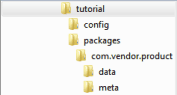

通过脚本控制，生成上述4个版本的仓库：
```txt
$ tree staging                                                               □ QtIFWPackTest △⎪▴│1│▪┤3│●◦◎◦✕⎥via △ v3.28.3  16:35
staging
├── packages-1.0.0
│   ├── com.vendor.root.component1
│   │   ├── data
│   │   │   ├── app1
│   │   │   └── example.data
│   │   └── meta
│   │       └── package.xml
│   └── com.vendor.root.component1.subcomponent1
│       ├── data
│       │   ├── helper.data
│       │   └── libhelper.so
│       └── meta
│           └── package.xml
├── packages-1.1.0
│// ...
├── packages-1.2.0
│// ...
└── packages-1.3.0
 // ...
```

`package.xml` 内容如下：

```xml
<Package>
  <DisplayName>com.vendor.root.component1</DisplayName>
  <Description>com.vendor.root.component1 1.0.0</Description>
  <Version>1.0.0</Version>
  <ReleaseDate>2025-04-25</ReleaseDate>
  <Default>true</Default>
  <Licenses>
    <License name="License Agreement" file="license.txt"/>
  </Licenses>
  <Script>installscript.qs</Script>
</Package>

```

`package.xml`的额外配置：
```xml
<?xml version="1.0"?>
<Package>
    <DisplayName>QtGui</DisplayName>
    <Description>Qt gui libraries</Description>
    <Description xml:lang="de_de">Qt GUI Bibliotheken</Description>
    <Version>1.2.3</Version>
    <ReleaseDate>2009-04-23</ReleaseDate>
    <Name>com.vendor.root.component2</Name>
    <Dependencies>com.vendor.root.component1</Dependencies>
    <Virtual>false</Virtual>
    <Licenses>
        <License name="License Agreement" file="license.txt"/>
    </Licenses>
    <Script>installscript.qs</Script>
    <UserInterfaces>
        <UserInterface>specialpage.ui</UserInterface>
        <UserInterface>errorpage.ui</UserInterface>
    </UserInterfaces>
    <Translations>
        <Translation>sv_se.qm</Translation>
        <Translation>de_de.qm</Translation>
    </Translations>
    <DownloadableArchives>component2.7z, component2a.7z</DownloadableArchives>
    <AutoDependOn>com.vendor.root.component3</AutoDependOn>
    <SortingPriority>123</SortingPriority>
    <UpdateText>This changed compared to the last release</UpdateText>
    <Default>false</Default>
    <ForcedInstallation>false</ForcedInstallation>
    <ForcedUpdate>false</ForcedUpdate>
    <Essential>false</Essential>
    <Replaces>com.vendor.root.component2old</Replaces>
    <Operations>
        <Operation name="AppendFile">
            <Argument>@TargetDir@/A.txt</Argument>
            <Argument>lorem ipsum</Argument>
        </Operation>
        <Operation name="Extract">
            <Argument>@TargetDir@/Folder1</Argument>
            <Argument>content.7z</Argument>
        </Operation>
        <Operation name="Extract">
            <Argument>@TargetDir@/Folder2</Argument>
        </Operation>
    </Operations>
    <TreeName moveChildren="true">com.vendor.subcomponent</TreeName>
</Package>
```

### 4. 远程仓库构建

使用 shell 脚本，调用 `repogen` 工具，生成各个版本的仓库：

```bash
# ...
QtIFWTools/repogen -p "$PKG_DIR" "$REPO_DIR"
# ...
```

- `$PKG_DIR` 为此前构建的 packages 仓库，须指定不同版本分别构建。  
- `$REPO_DIR` 为仓库的目标路径。

生成结构如下：  

```txt
$ tree server/static                                                         □ QtIFWPackTest △⎪▴│1│▪┤4│●◦◎◦✕⎥via △ v3.28.3  16:55
server/static
├── repo-1.0.0
│   ├── 2025-04-23-1617_meta.7z
│   ├── com.vendor.root.component1
│   │   ├── 1.0.0content.7z
│   │   ├── 1.0.0content.7z.sha1
│   │   └── 1.0.0meta.7z
│   ├── com.vendor.root.component1.subcomponent1
│   │   ├── 1.0.0content.7z
│   │   ├── 1.0.0content.7z.sha1
│   │   └── 1.0.0meta.7z
│   └── Updates.xml
├── repo-1.1.0
│/...
├── repo-1.2.0
│/...
└── repo-1.3.0
 /...
```

在使用 `repogen` 生成仓库时：  
`package.xml` 并不会被包含在压缩后的仓库中，被用于生成 `Updates.xml` 索引文件。

### 5. 仓库服务器搭建

> 静态资源服务器是一种用于托管不会改变的资源，如HTML、CSS、JavaScript文件、图片等的服务器。这些资源通常以文件的形式存在，服务器处理这些资源的请求时，通常只需读取文件内容并返回给客户端。

使用 Golang 搭建静态资源文件服务器，在本地端口测试，托管上述生成的`./static`中的内容：

```C++
func main() {
    // ...
	fs := http.StripPrefix("/repo", http.FileServer(http.Dir("./static")))
	http.Handle("/repo/", fs)

	http.HandleFunc("/", func(w http.ResponseWriter, r *http.Request) {
		http.Redirect(w, r, "/repo/", http.StatusFound) // 302 Temporary Redirect
	})

	err := http.ListenAndServe("0.0.0.0:8090", nil)
	// ...
}
```

仓库效果：
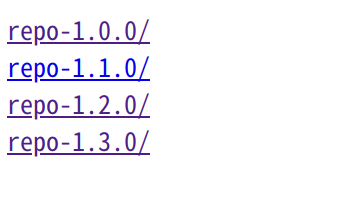

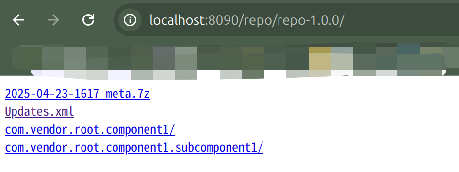

**服务端密码设置**：

> 实际上可以在nginx的配置里直接用`root`设置本地路径，将其作为静态资源服务器。  
> 但此处已经写好Golang服务器，另外考虑可能有服务端校验和等规则，此处将nigix直接作为反向代理：监听8091端口，代理8090的服务。

需要 Nginx 和 htpasswd 工具。

添加一个user`tr`，设置密码`123456`：
```bash
sudo htpasswd -c /etc/nginx/.htpasswd tr
```

修改nginx配置：
```bash
sudo nvim /etc/nginx/sites-available/default
````

设置规则（监听`8091`端口，反向代理之前的Go仓库服务）：

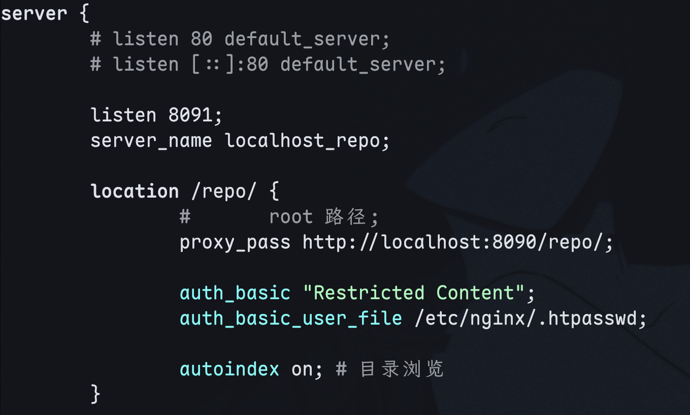

启动nignx：

```bash
sudo systemctl start nginx
```

重新加载配置：

```bash
sudo nginx -s reload
```

之后访问可见：

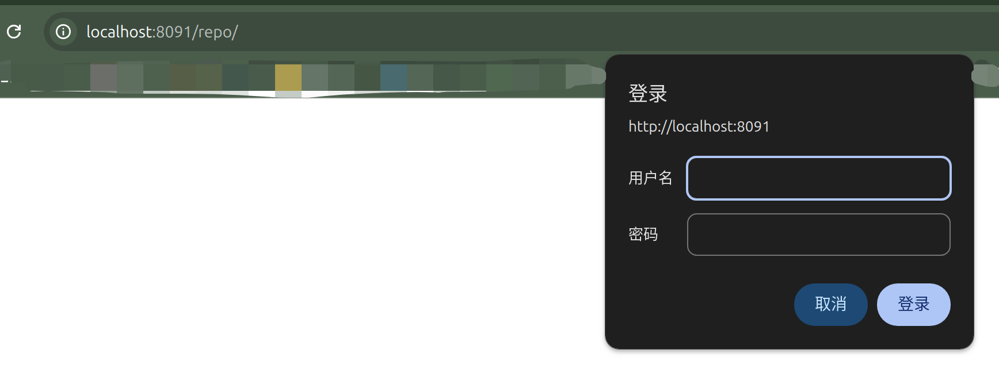

### 6. 安装包配置文件 `config.xml` 配置

指定了以下内容：

```xml
<?xml version="1.0" encoding="UTF-8"?>
<Installer>
    <Name>QtIFW Pack Test - TR</Name>
    <Version>1.0.0</Version> <!-- 安装器自身版本，不影响组件版本 -->
    <Title>QtIFW 测试安装器 - Title</Title>
    <Publisher>张祝玙</Publisher>
    <ProductUrl>https://www.qq.com</ProductUrl>
    <!-- 一些图标和水印 -->
    <InstallerWindowIcon>images/installer.png</InstallerWindowIcon>
    <InstallerApplicationIcon>images/installer.png</InstallerApplicationIcon>
    <Logo>images/logo.png</Logo>
    <Background>images/background.png</Background>
    <Watermark>images/watermark.png</Watermark>
    <!--  安装完成后可以直接勾选运行的可执行程序-->
    <RunProgram>@TargetDir@/app1</RunProgram>
    <RunProgramArguments>
        <Argument>Arg1</Argument>
        <Argument>Arg2</Argument>
    </RunProgramArguments>
    <RunProgramDescription>QtIFW 测试程序 - Description</RunProgramDescription>
    <!--  一些路径和命名-->
    <StartMenuDir>QtIFWTest</StartMenuDir>
    <MaintenanceToolName>TestMaintenanceTool</MaintenanceToolName>
    <AllowNonAsciiCharacters>true</AllowNonAsciiCharacters>
    <TargetDir>@HomeDir@/QtIFWTest/1.0.0</TargetDir>
    <AdminTargetDir>@RootDir@/QtIFWTest/1.0.0</AdminTargetDir>
    <!--  创建本地仓库（后续添加组件可选择）-->
    <CreateLocalRepository>true</CreateLocalRepository>
    <InstallActionColumnVisible>true</InstallActionColumnVisible>
    <!--  配置远程仓库-->
    <RemoteRepositories>
    <!--  <Repository>以包含Updates.xml的路径为单位，此处需要每个版本各配置一个-->
        <Repository>
            <Url>http://localhost:8090/repo</Url>
            <Enabled>true</Enabled>
            <DisplayName>本地测试仓库(Mint)</DisplayName>
        </Repository>
        <Repository>
            <Url>http://localhost:8090/repo/repo-1.0.0/</Url>
            <Enabled>true</Enabled>
            <DisplayName>本地测试仓库(Mint)-1.0.0</DisplayName>
        </Repository>
        <Repository>
            <Url>http://localhost:8090/repo/repo-1.1.0/</Url>
            <Enabled>true</Enabled>
            <DisplayName>本地测试仓库(Mint)-1.1.0</DisplayName>
        </Repository>
        <Repository>
            <Url>http://localhost:8090/repo/repo-1.2.0/</Url>
            <Enabled>true</Enabled>
            <DisplayName>本地测试仓库(Mint)-1.2.0</DisplayName>
        </Repository>
        <Repository>
            <!--  此处8091是nginx反向代理的端口-->
            <Url>http://localhost:8091/repo/repo-1.3.0/</Url>
            <Enabled>true</Enabled>
            <!--   对最新仓库启用用户与密码进行测试-->
            <Username>tr</Username>
            <Password>123456</Password>
            <DisplayName>本地测试仓库(Mint)-1.3.0</DisplayName>
        </Repository>
        <Repository>
            <Url>http://172.16.20.15:8090/repo/</Url>
            <Enabled>true</Enabled>
            <DisplayName>局域网测试仓库(DELL)</DisplayName>
        </Repository>
    </RemoteRepositories>
    <!--  为组件添加一些别名，此处未使用-->
    <AliasDefinitionsFile>aliases.xml</AliasDefinitionsFile>
</Installer>
```

- `<Username>` ，用作受保护存储库上的用户。
- `<DisplayName>` ，可选择设置要显示的字符串而不是 URL。

config.xml` 中的 `<RepositoryCategory>` 元素可以包含多个 `<RemoteRepositories>` 元素的列表（此处未启用）：

```xml
<RepositoryCategories>
    <RemoteRepositories>
        <Displayname>Category 1</Displayname>
        <Preselected>true</Preselected>
        <Tooltip>Tooltip for category 1</Tooltip>
        <Repository>
            <Url>http://www.example.com/packages</Url>
            <Enabled>1</Enabled>
            <Username>user</Username>
            <Password>password</Password>
            <DisplayName>Example repository</DisplayName>
        </Repository>
    </RemoteRepositories>
</RepositoryCategories>
```

### 7. 离线安装包构建

为测试后续更新功能，使用 `1.0.0` 版本构建安装包程序：

```bash
QtIFWTools/binarycreator \
  --offline-only \
  -c installer-config/config.xml \
  -p staging/packages-1.0.0 \
  -t QtIFWTools/installerbase \
  release/offlineInstaller-1.0.0.run
```

分别指定了配置文件路径、包位置、可执行文件目标路径。

此处使用 `--offline-only` 构建离线安装包，会将 `staging/packages-1.0.0` 中内容打包进可执行程序。


### 8. 安装

运行安装包程序：  

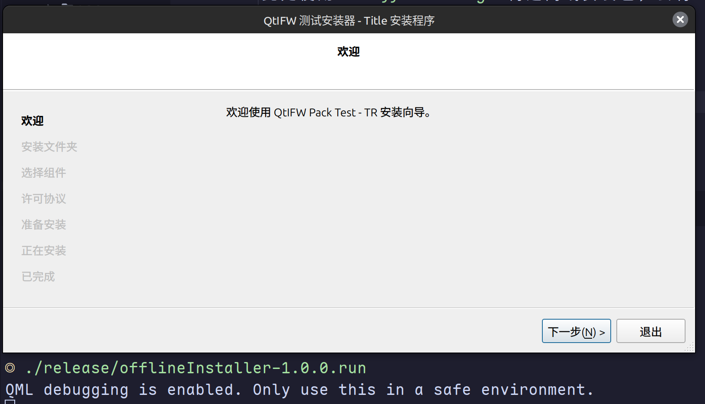


此处可见组件的树状关系（此前 `package.xml` 中并未显式指定依赖关系，此处是命名导致的行为）：

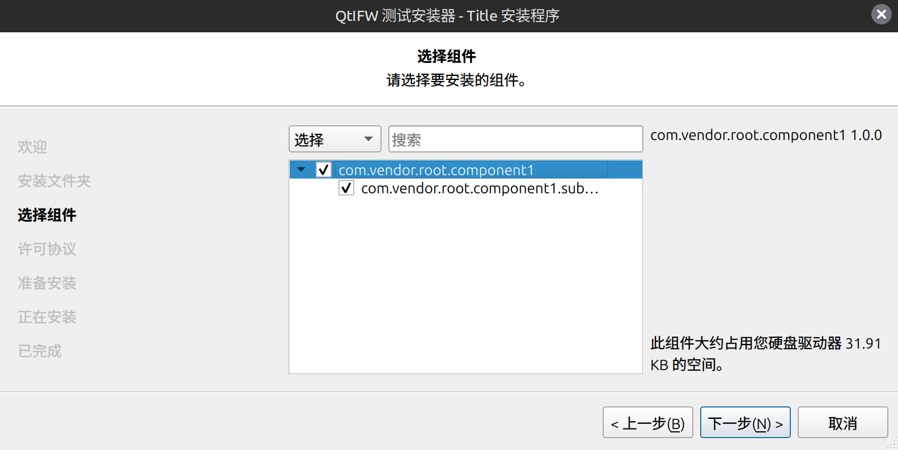

无许可协议，直接跳到准备安装：

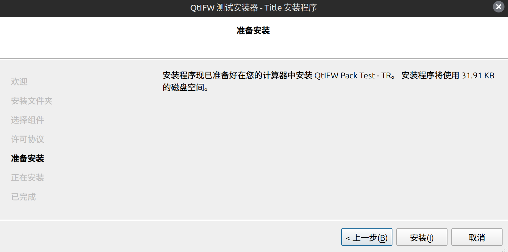

安装成功，可以直接运行指定的程序：


```txt
Running app1 (component 1)
Received arguments:
  argv[0] = /home/horeb/QtIFWTest/test/app1
  argv[1] = Arg1
  argv[2] = Arg2
Hello from libhelper.so!
```

安装完成后目录结构：


```txt
$ tree                                                   □ QtIFWTest/test 17:14
.
├── app1
├── components.xml
├── example.data
├── helper.data
├── InstallationLog.txt
├── installer.dat
├── installerResources
│   ├── com.vendor.root.component1
│   │   └── 1.0.0content.txt
│   └── com.vendor.root.component1.subcomponent1
│       └── 1.0.0content.txt
├── libhelper.so
├── network.xml
├── repository
│   ├── com.vendor.root.component1
│   │   ├── 1.0.0content.7z
│   │   ├── 1.0.0content.7z.sha1
│   │   └── 1.0.0meta.7z
│   ├── com.vendor.root.component1.subcomponent1
│   │   ├── 1.0.0content.7z
│   │   ├── 1.0.0content.7z.sha1
│   │   └── 1.0.0meta.7z
│   └── Updates.xml
├── TestMaintenanceTool
├── TestMaintenanceTool.dat
└── TestMaintenanceTool.ini
```

`repository/` 下可见生成的本地仓库。

`TestMaintenanceTool.ini` 存储编码后的仓库地址。

`network.xml`为网络代理内容及后续添加的新仓库：

```xml
<?xml version="1.0"?>
<Network>
    <ProxyType>1</ProxyType>
    <Ftp>
        <Host></Host>
        <Port>0</Port>
        <Username></Username>
        <Password></Password>
    </Ftp>
    <Http>
        <Host></Host>
        <Port>0</Port>
        <Username></Username>
        <Password></Password>
    </Http>
    <Repositories/>
    <LocalCachePath>/home/horeb/.cache/qt-installer-framework/9e7b92a2-c218-384a-b87e-f010be7ddfbf</LocalCachePath>
</Network>
```

手动添加一个自定义仓库`qq.com`测试，可以看到`network.xml`中新增了条目：


本地的components.xml用于与远程仓库的对比：  
```xml
<Packages>
    <ApplicationName>QtIFW Pack Test - TR</ApplicationName>
    <ApplicationVersion>1.0.0</ApplicationVersion>
    <Package>
        <Name>com.vendor.root.component1</Name>
        <Title>com.vendor.root.component1</Title>
        <Description>com.vendor.root.component1 1.0.0</Description>
        <SortingPriority>0</SortingPriority>
        <TreeName moveChildren="false"></TreeName>
        <Version>1.0.0</Version>
        <LastUpdateDate></LastUpdateDate>
        <InstallDate>2025-04-23</InstallDate>
        <Size>16630</Size>
        <Checkable>true</Checkable>
    </Package>
    <Package>
        <Name>com.vendor.root.component1.subcomponent1</Name>
        <Title>com.vendor.root.component1.subcomponent1</Title>
        <Description>com.vendor.root.component1.subcomponent1 1.0.0</Description>
        <SortingPriority>0</SortingPriority>
        <TreeName moveChildren="false"></TreeName>
        <Version>1.0.0</Version>
        <LastUpdateDate></LastUpdateDate>
        <InstallDate>2025-04-23</InstallDate>
        <Size>16049</Size>
        <Checkable>true</Checkable>
    </Package>
</Packages>
```

### 9. 在线安装包构建

```bash
QtIFWTools/binarycreator \
  -c installer-config/config.xml \
  -p staging/packages-1.0.0 \
  -e com.vendor.root.component1,com.vendor.root.component1.subcomponent1 \
  -t QtIFWTools/installerbase \
  release/onlineInstaller-1.0.0.run
```

- `-e` 是 `--exclude` 的简写，表示从最终的安装器中排除某些组件。这些组件不会包含在安装包中，但可以从在线源中手动选择安装。


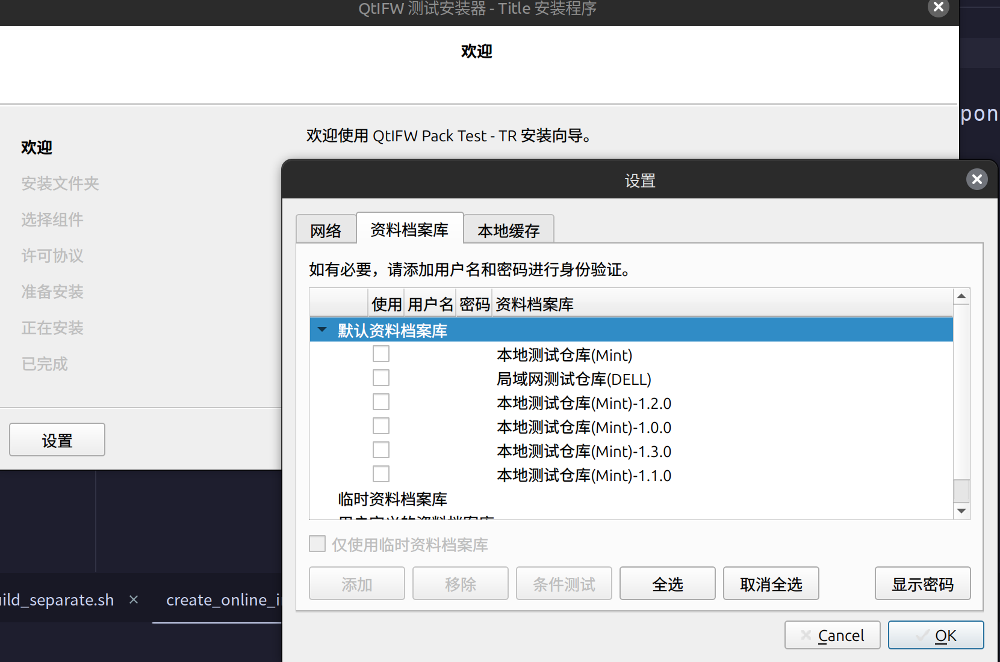


若此前设置用户与密码，此处会进行填充：


### 9. 更新

运行此前安装目录中自动生成的 `TestMaintenanceTool`：

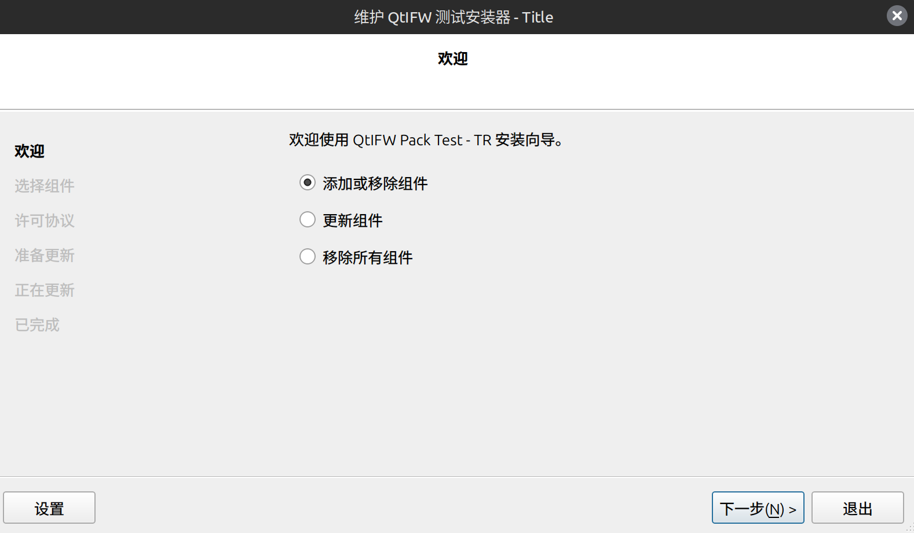

若本地版本为所有仓库中的最高版本：


左下角 [设置] 中可指定：

- 系统代理：

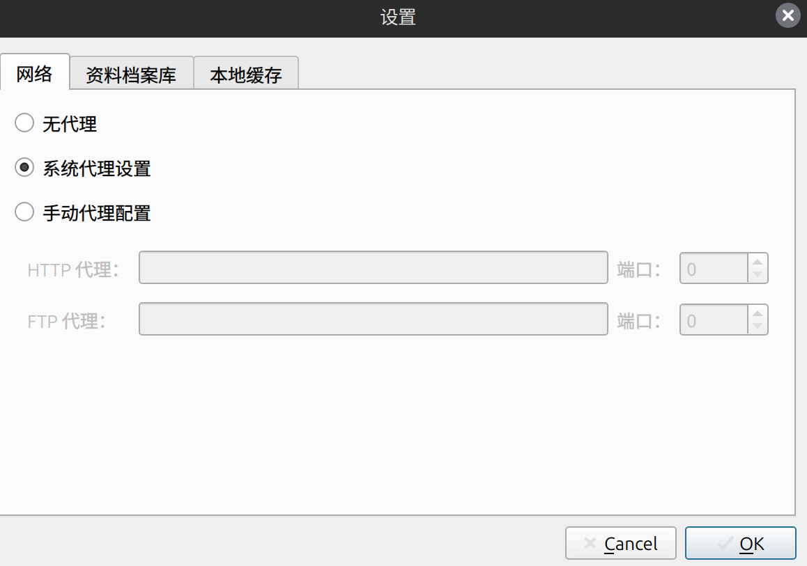

- 资料档案库（仓库）
此处可见之前指定的各个仓库（此处仅勾选本地仓库与 `1.2.0` 版本的仓库）。

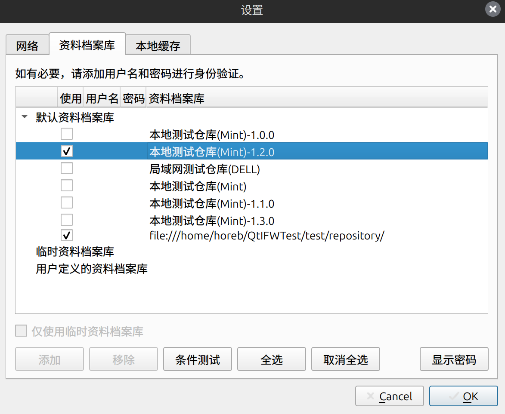

- 本地缓存路径


选择更新，可以注意到此处只能选择已经勾选的最新版本（如果勾选`1.3.0`的仓库则只能升级至`1.3.0`）：


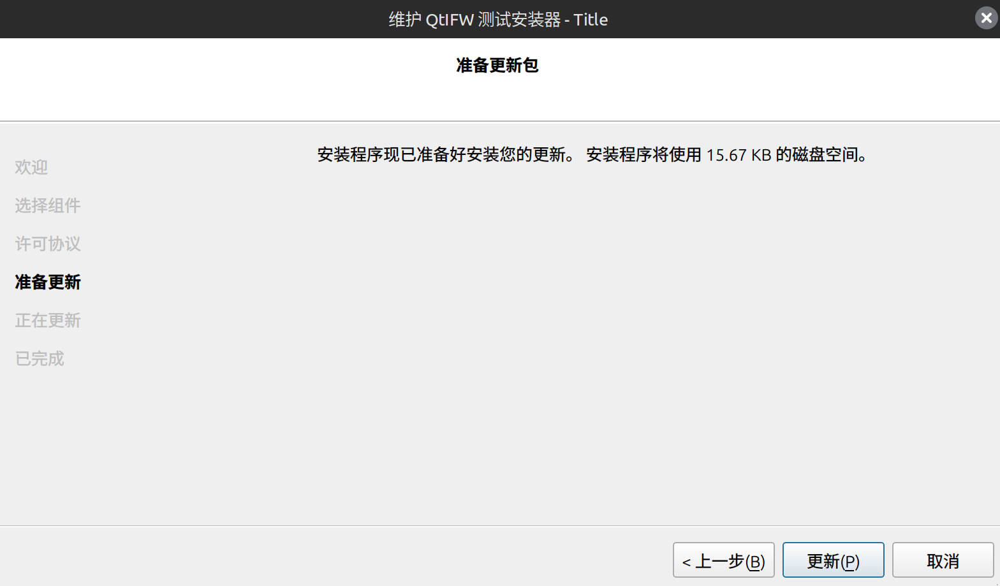

更新完成：

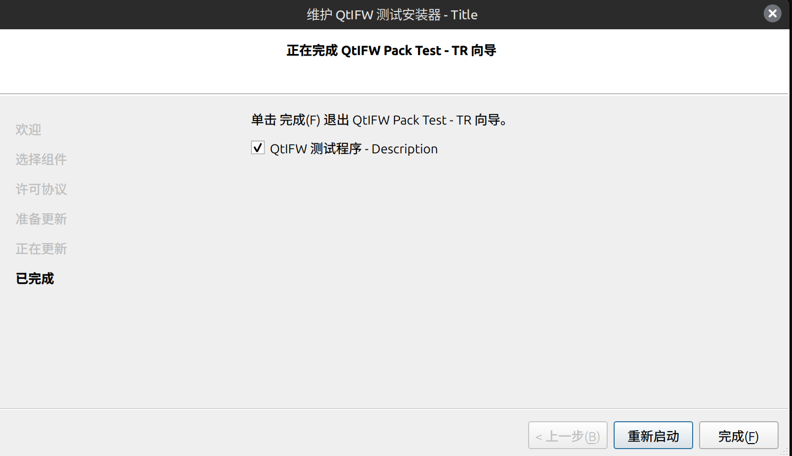

---

### 测试：components.xml

手动修改 `components.xml` 的内容，将组件版本改为 `1.1.0`，实际已更新至 `1.2.0`：

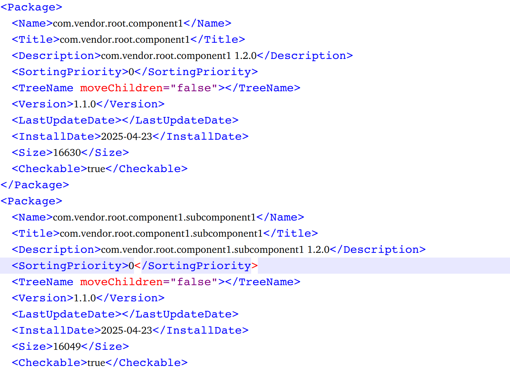

打开更新，发现仍识别本地是 `1.2.0` （即为正确的版本）。

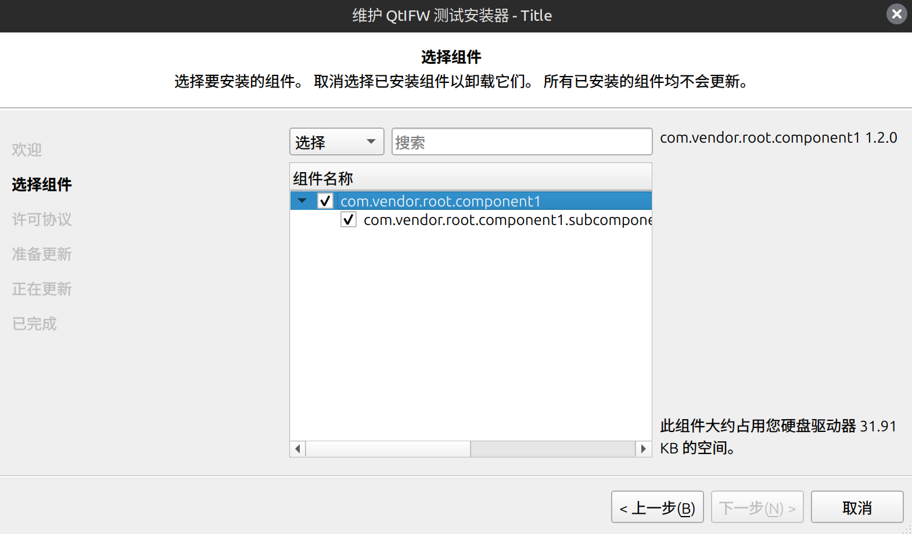

更新至`1.3.0`。发现 components.xml 已随之更新：


---

### 查看缓存目录：

```txt
$ tree      □ qt-installer-framework/8f696b25-f428-3e56-af40-667b325181e4 17:24
.
├── e907291c46b9087534e5a4c94edb81046452011a
│   ├── com.vendor.root.component1
│   ├── com.vendor.root.component1.subcomponent1
│   ├── repository.txt
│   └── Updates.xml
└── manifest.json
```

```txt
$ cat manifest.json
{
    "items": [
        "e907291c46b9087534e5a4c94edb81046452011a"
    ],
    "type": "Metadata",
    "version": "1.2.0"
}
```

```txt
$ cat repository.txt
/repo%  
```

---

### 网络测试

使用`tcpdump`对8090端口（服务器监听端口）进行抓包：

```bash
sudo tcpdump -i lo -w localhost_ifw.pcap port 8090
```

使用`wireshark`的图形化界面查看：

```bash
wireshark localhost_ifw.pcap
```


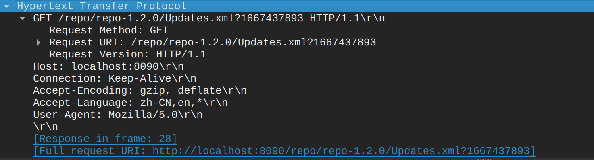

请求Updates.xml时的完整url：`[Full request URI: http://localhost:8090/repo/repo-1.2.0/Updates.xml?3624636785]`  
"cache busting"，在 URL 后附带一个随机数或时间戳，用于：
- 避免浏览器或代理服务器缓存静态文件  
- 确保每次请求都拿到最新的内容

`/repo/repo-1.2.0/Updates.xml?...`

`/repo/repo-1.2.0/com.vendor.root.component1/1.2.0content.7z.sha1`

`/repo/repo-1.2.0/com.vendor.root.component1/1.2.0content.7z`

`/repo/repo-1.2.0/com.vendor.root.component1.subcomponent1/1.2.0content.7z.sha1`

- **问**：对设置了用户名和密码的仓库也进行了测试（仅在安装包即客户端设置，服务端未设置规则），为什么没有携带用户名或密码？


Installer 行为是“懒发送”（延迟发送认证）：  
并不会主动发送用户名和密码——只有在服务器响应 401 Unauthorized 的时候，它才会携带用户名和密码（通常是用 Basic Auth）。

该`GET`请求没有没有 `Authorization` 头，这是因为服务端根本没要求验证（也就是没返回 `401`）。

因此配置nginx认证规则后，抓包8091端口：  

```bash
sudo tcpdump -i lo -w localhost_ifw_nginx.pcap port 8091
```


此处可见安装包请求`Updates.xml`时，服务端返回的`HTTP/1.1 401 Unauthorized\r\n`：


之后重新发送GET请求，携带`tr`和`123456`

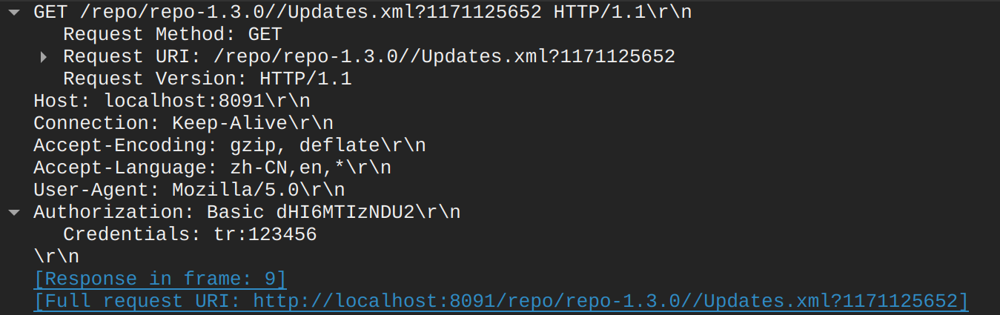

